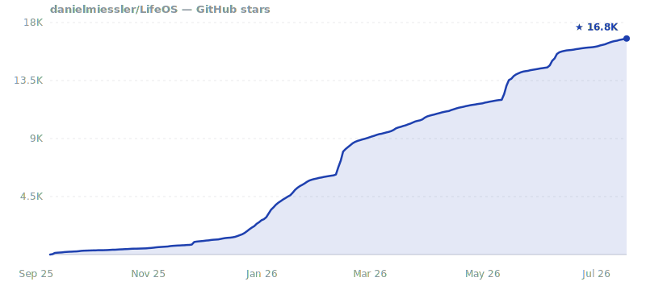

<p align="center">
  <br />
  
  <br />
</p>

<div align="center">

**The AI-Powered Life Operating System**

[](https://github.com/danielmiessler/LifeOS)

[](https://github.com/danielmiessler/LifeOS/stargazers)
[](https://github.com/danielmiessler/LifeOS/network/members)
[](https://github.com/danielmiessler/LifeOS/commits/main)
[](https://github.com/danielmiessler/LifeOS/graphs/contributors)

[](https://github.com/danielmiessler/LifeOS/releases)
[](./LICENSE)
[](https://claude.ai/code)

[](https://www.typescriptlang.org/)
[](https://bun.sh)
[](https://ourlifeos.ai)
[](https://discord.gg/danielmiessler)

**[Website](https://ourlifeos.ai)** · **[Install](#install)** · **[Walkthrough](https://youtu.be/Le0DLrn7ta0)** · **[Docs](https://docs.ourlifeos.ai)** · **[Releases](https://github.com/danielmiessler/LifeOS/releases)**

</div>

---

https://github.com/user-attachments/assets/329897f5-828b-4c23-b607-1cf9c71cb4ec

**LifeOS** is a General Purpose AI Harness for doing anything you want to do in life and work with AI. It captures who you are, what you care about, and where you're trying to go, then uses AI that knows you to help you get there. 

And because it has your full context, it makes everything you do more efficient and effective, from building apps, to starting a business, to creative projects…_basically anything_.

> [!NOTE]
> The whole system works on one central concept: **moving from your Current State to your Ideal State** — in pursuit of Euphoric Surprise.

<div align="center">

### ⭐ If LifeOS is useful to you, star the repo

Stars help more people find the project and keep it moving. It takes one click.

[](https://github.com/danielmiessler/LifeOS)

</div>

## Install

**Give it to your AI.** LifeOS is installed *by* an AI, so the install is just a prompt. Paste this into your AI coding harness — Claude Code, Cursor, Codex, Hermes, or any capable agent — and it does the whole setup for you:

```
Read https://ourlifeos.ai/install and install LifeOS for me.
```

Your AI reads the install page and walks the setup, asking permission before it touches anything.

**Prefer the terminal?** There's a one-line shortcut for Claude Code on macOS/Linux:

```bash
curl -fsSL https://ourlifeos.ai/install.sh | bash
```

Either path needs a capable AI coding harness — we build and run on [Claude Code](https://docs.claude.com/claude-code) — and [bun](https://bun.sh).

## Core Components

**The unique features** — the parts you won't find anywhere else, plus the subsystems underneath. See them live and click through on **[ourlifeos.ai](https://ourlifeos.ai)**.

<a href="https://ourlifeos.ai"></a>

---

## 🧩 Skills

LifeOS installs as one self-contained skill that bundles the whole library — research, security, writing, art, and more. Browse them all on the site.

**[Browse all skills →](https://ourlifeos.ai/skills)**

---

## ❓ FAQ

### How is LifeOS different from using an AI harness on its own?

Your harness gives you raw capability. LifeOS is the layer on top that makes it *yours* — a system that knows your goals, people, and context, and keeps working toward them:

- **Persistent memory** — Your DA remembers past sessions, decisions, and learnings
- **Custom skills** — Specialized capabilities for the things you do most
- **Your context** — Goals, contacts, preferences—all available without re-explaining
- **Intelligent routing** — Say "research this" and the right workflow triggers automatically
- **Self-improvement** — The system modifies itself based on what it learns

Your harness is the engine. LifeOS is everything else that makes it *your* car.

### What harness does LifeOS run on?

Any high-end one. LifeOS is harness-agnostic by design — it's built on universal primitives (hooks, skills, context files, agentic routing), not one vendor's features. The code is TypeScript and Bash, and the core ideas — TELOS, the Algorithm, skills, memory — port to any capable agent.

Daniel builds and runs it on [Claude Code](https://docs.claude.com/claude-code), so that's the most-tested path today. But LifeOS isn't locked to it, and it's designed to run wherever your AI does.

### How is this different from fabric?

[Fabric](https://github.com/danielmiessler/fabric) is a collection of AI prompts (patterns) for specific tasks. It's focused on *what to ask AI*.

LifeOS is infrastructure for *how your DA operates*—memory, skills, routing, context, self-improvement. They're complementary. Many LifeOS users integrate Fabric patterns into their skills.

### What if I break something?

Recovery is straightforward:

- **Back up first** — Before any upgrade: `cp -r ~/.claude ~/.claude-backup-$(date +%Y%m%d)`
- **USER/ is safe** — Your customizations in `USER/` are never touched by the installer or upgrades
- **Settings merge, not overwrite** — The installer only updates identity and version fields; your hooks, statusline, and custom config are preserved
- **Git-backed** — Version control everything, roll back when needed
- **History is preserved** — Your DA's memory survives mistakes
- **DA can fix it** — Your DA helped build it, it can help repair it
- **Re-install** — Run the installer again; it detects existing installations and merges intelligently

---

## 🎯 Roadmap

| Feature | Description |
|---------|-------------|
| **Local Model Support** | Run LifeOS with local models (Ollama, llama.cpp) for privacy and cost control |
| **Granular Model Routing** | Route different tasks to different models based on complexity |
| **Remote Access** | Access your LifeOS from anywhere—mobile, web, other devices |
| **Outbound Phone Calling** | Voice capabilities for outbound calls |
| **External Notifications** | Robust notification system for Email, Discord, Telegram, Slack |

---

## 🌐 Community

**GitHub Discussions:** [Join the conversation](https://github.com/danielmiessler/LifeOS/discussions)

**Community Discord:** LifeOS is discussed in the [community Discord](https://danielmiessler.com/upgrade) along with other AI projects

**Twitter/X:** [@danielmiessler](https://twitter.com/danielmiessler)

**Blog:** [danielmiessler.com](https://danielmiessler.com)

### Star History

<!-- Self-hosted chart: star-history.com's embed API 500s on repos this size
     (10s timeout re-fetching ~17K stargazers per render). Regenerate at release:
     bun LIFEOS/TOOLS/GenerateStarHistory.ts danielmiessler/LifeOS images/star-history.svg -->
<a href="https://star-history.com/#danielmiessler/LifeOS&Date">
 
</a>

---

## 🤝 Contributing

We welcome contributions! See our [GitHub Issues](https://github.com/danielmiessler/LifeOS/issues) for open tasks.

1. **Fork the repository**
2. **Make your changes** — Bug fixes, new skills, documentation improvements
3. **Test thoroughly** — Install in a fresh system to verify
4. **Submit a PR** with examples and testing evidence

---

## 📜 License

MIT License - see [LICENSE](LICENSE) for details.

---

## 🙏 Credits

**Anthropic and the Claude Code team** — First and foremost. You are moving AI further and faster than anyone right now. Claude Code is the foundation that makes all of this possible.

**[IndyDevDan](https://www.youtube.com/@indydevdan)** — For great videos on meta-prompting and custom agents that have inspired parts of LifeOS.

### Contributors

LifeOS is built in the open, and the community's pull requests, forensic bug reports, and fresh-install writeups directly shape every release. The public repo is generated from a private source tree, so community PRs are ported into source with credit rather than merged directly — same fix, durable across releases.

<p align="center">
<a href="https://github.com/danielmiessler"></a>
<a href="https://github.com/christauff"></a>
<a href="https://github.com/kaimagnus"></a>
<a href="https://github.com/m4nt0de4"></a>
<a href="https://github.com/ksylvan"></a>
<a href="https://github.com/mvoehringer"></a>
<a href="https://github.com/sauldataman"></a>
<a href="https://github.com/sti0"></a>
<a href="https://github.com/pybe"></a>
<a href="https://github.com/fayerman-source"></a>
<a href="https://github.com/neilsoult"></a>
<a href="https://github.com/HotSauceHacker"></a>
<a href="https://github.com/salmanmkc"></a>
<a href="https://github.com/Seadubb"></a>
<a href="https://github.com/StarksLabs"></a>
<a href="https://github.com/asdf8675309"></a>
<a href="https://github.com/imrathion"></a>
<a href="https://github.com/jbmml"></a>
<a href="https://github.com/justinkatz94-glitch"></a>
<a href="https://github.com/bkolendowski"></a>
<a href="https://github.com/smolcompute"></a>
<a href="https://github.com/neilinger"></a>
<a href="https://github.com/Mutdogus"></a>
<a href="https://github.com/qozle"></a>
<a href="https://github.com/jnpkr"></a>
<a href="https://github.com/IJASolutions"></a>
<a href="https://github.com/emory"></a>
<a href="https://github.com/maxolasersquad"></a>
</p>

<sup>The 28 highest-commit contributors — [see all on the contributors graph](https://github.com/danielmiessler/LifeOS/graphs/contributors). Avatars are committers only, so the lists below carry everyone the graph can't see.</sup>

**[fayerman-source](https://github.com/fayerman-source)** — Google Cloud TTS provider integration and Linux audio support for the voice system.

**Matt Espinoza** — Extensive testing, ideas, and feedback, plus roadmap contributions.

**Code contributions (merged or ported PRs):**
adamlevoy · anikinsasha · asdf8675309 · atabisz · chrisglick · christauff · erf1nd0r · HotSauceHacker · imrathion · jbmml · jnpkr · justinkatz94-glitch · ksylvan · m4nt0de4 · MarvinDontPanic · maxolasersquad · Mutdogus · neilinger · neilsoult · pybe · qozle · rpriven · salmanmkc · sauldataman · Seadubb · Spirotot · StarksLabs · thatsjet

**Bug reports, fresh-install forensics, and design feedback:**
badosanjos · bnkath2o · brycemagera · catchingknives · DAESA24 · deleyva · DennisTraub · docxology · DolphusCY · donovan-sec · DonovanJonesUK · eccentricnode · fjp-veo · harryf · hjbrandt · HyggeHacker · ichoosetoaccept · infinitelyloopy-bt · JElliottMiller · jdrolls · jlacour-git · jmmarkiewicz · karlwaldman · klausagnoletti · lexilexikon · lgangitano · luccomo · MatiasBarboza · MHoroszowski · michaelaye · mygirleatsmayo · nbost130 · NodarDavituri · NorthwoodsSentinel · packetsherpa · ricklesgibson · rikitikitavi2012-debug · Riskjuggler · simeonzickert · Steffen025 · stratofax · tzioup · vanvonlj · vichong · virtualian · vpzed · waveman2020-sudo · wojteksbt · xmasyx

<sup>Refreshed with each release. If your contribution is missing, open an issue — that's a bug too.</sup>

---

## 💜 Support This Project

<div align="center">

<a href="https://github.com/sponsors/danielmiessler"></a>

**LifeOS is free and open-source forever. If you find it valuable, you can [sponsor the project](https://github.com/sponsors/danielmiessler).**

</div>

---

## 📚 Related Reading

- [The Real Internet of Things](https://danielmiessler.com/blog/the-real-internet-of-things) — The vision behind LifeOS
- [AI's Predictable Path: 7 Components](https://danielmiessler.com/blog/ai-predictable-path-7-components-2024) — Visual walkthrough of where AI is heading
- [Building a Personal AI Infrastructure](https://danielmiessler.com/blog/personal-ai-infrastructure) — Full walkthrough with examples

---

<details>
<summary><strong>📜 Update History</strong></summary>

<br/>

**v7.1.1 — Install Awareness**
- **Doctor** — `bun LIFEOS/TOOLS/Doctor.ts` reports the real state of every optional capability (live, broken, declined, stale) and reconciles hooks on disk against what's registered.
- **Capability-aware install** — the installer asks now/later/never per optional capability and records the choice; failure-aware nudges surface the exact fix command when a broken capability trips.
- **System Health in Pulse** — capability states, fix commands, and heartbeats on the hooks page.
- **Algorithm v8.4.0** — plain-language depth steering registers before a run opens; nudges bounded to a single line.
- **Community fixes** — #1450, #1456, #1463, #1470, #1471. Thanks to the contributors.
- [Full release notes](https://github.com/danielmiessler/LifeOS/releases)

**v7.0.0 — The Bitter Pill Release**
- **Bitter Pill Engineering** — scaffolding cut across the whole system on one test: would a smarter model make this rule unnecessary? Reasoning choreography, self-scores, and duplicated routing are gone; the verification kernel stays.
- **Context roughly two-thirds smaller** — the always-loaded doctrine plus its old capabilities file went from ~88KB to ~28KB, so every turn is faster and sharper.
- **Modes and tiers retired** — one adaptive response format and one Algorithm loop that scales spend to what the work reveals, discovered not predicted.
- **The Algorithm v8.3.0** — the ISA is both the hill and the instrument; claims close only on tool evidence, and a single deterministic AlgorithmNudge layer keeps a run on track.
- **Hook layer consolidated** — ~16 hooks folded into per-event dispatchers, plus community fixes for a work-events race, DA-name de-hardcoding, and config-driven identity.
- [Full release notes](https://github.com/danielmiessler/LifeOS/releases)

**v6.0.3 (2026-07-04) — Comprehensive AI-native install**
- Comprehensive component menu — INSTALL.md lays out the full two-tier model: Core plus à-la-carte enhancements (hooks, statusline, tooltips, spinner verbs, agents, Pulse, background jobs)
- The `lifeos` launch alias wires `--append-system-prompt-file` so the constitutional layer actually loads
- One canonical INSTALL.md rendered at ourlifeos.ai/install for humans and AIs
- [Full release notes](https://github.com/danielmiessler/LifeOS/releases)

**v6.0.2 (2026-07-03) — .md-first AI-native install**
- Skill-only distribution with an AI-native, `.md`-first install
- The shipped install.sh pins v6.0.2 and points at danielmiessler/LifeOS
- [Full release notes](https://github.com/danielmiessler/LifeOS/releases)

**v6.0.0 (2026-07-02) — One Skill, One Install**
- **Skill-based distribution** — the whole system now ships as a single self-contained skill (`LifeOS/`): the orchestrator (SKILL.md + Workflows + Tools) plus a complete install payload (system prompt, Algorithm, 49 skills, hooks, agents, Pulse, statusline, USER + MEMORY scaffolds). One directory, one install.
- **First release under the LifeOS name** — the project was PAI (Personal AI Infrastructure); this is the same system, renamed.
- **Install by prompt** — hand it to your AI (*"Read https://ourlifeos.ai/install and install LifeOS for me"*); a `curl … | bash` shortcut lays it down from a terminal too.
- **Full Pulse on first boot** — the installer stands up the Life Dashboard and menu-bar app, ships generic TELOS templates so the dashboard renders on a fresh install, and runs the setup interview to seed it.
- **Algorithm v6.23.0** — Current State → Ideal State across seven phases, classifier-driven mode + tier, cross-vendor verification at E4/E5.
- **Clean by construction** — nothing personal ships; the USER tree is a blank template you populate. Release gates + a cross-vendor audit run before every publish.
- [Full release notes](https://github.com/danielmiessler/LifeOS/releases)

**v5.0.0 (2026-04-30) — Life Operating System**
- **Pulse** — unified daemon (port 31337): voice, hooks, observability, cron, Life Dashboard, wiki API, optional Telegram/iMessage bridges. Replaces every previous loose service.
- **The DA** — Digital Assistant identity layer. PRINCIPAL_IDENTITY + DA_IDENTITY pair, loaded at session start. `/interview` walks you through naming your DA, picking a voice, capturing TELOS.
- **Algorithm v6.3.0** — seven-phase loop (OBSERVE → THINK → PLAN → BUILD → EXECUTE → VERIFY → LEARN). Classifier picks MINIMAL/NATIVE/ALGORITHM and tier (E1–E5) per prompt. Verification doctrine (live-probe, advisor calls, cross-vendor audit at E4/E5).
- **ISA System** — Ideal State Artifact primitive. One document, twelve sections, five identities. Owned by the **ISA skill**.
- **Containment + release tooling** — privacy is structural. Security gates run on every public release; two-stage release (stage → publish) never auto-chains.
- **Memory v7.6** — structured by purpose: WORK, KNOWLEDGE (typed graph), LEARNING, RELATIONSHIP, OBSERVABILITY, STATE.
- [Full release notes + migration guide](https://github.com/danielmiessler/LifeOS/releases)

**v4.0.3 (2026-03-01) — Community PR Patch**
- JSON array parsing fix in Inference.ts, 29 dead references removed, portability fixes, user context migration
- [Release Notes](https://github.com/danielmiessler/LifeOS/releases)

**v4.0.0 (2026-02-27) — Lean and Mean**
- 38 flat skill directories → 12 hierarchical categories, dead systems removed, CLAUDE.md template system, comprehensive security sanitization
- [Release Notes](https://github.com/danielmiessler/LifeOS/releases)

**v3.0.0 (2026-02-15) — The Algorithm Matures**
- Algorithm v1.4.0, persistent PRDs and parallel loop execution, full installer with GUI wizard, agent teams/swarm, voice personality system
- [Release Notes](https://github.com/danielmiessler/LifeOS/releases)

**v2.4.0 (2026-01-23) — The Algorithm**
- Universal problem-solving system with ISC tracking, Euphoric Surprise as the outcome metric
- [Release Notes](https://github.com/danielmiessler/LifeOS/releases)

**v2.0.0 (2025-12-28) — v2 Launch**
- Modular architecture with independent skills, Claude Code native design

</details>

---

<div align="center">

**Built with ❤️ by [Daniel Miessler](https://danielmiessler.com) and the LifeOS community**

*Augment yourself.*

</div>
